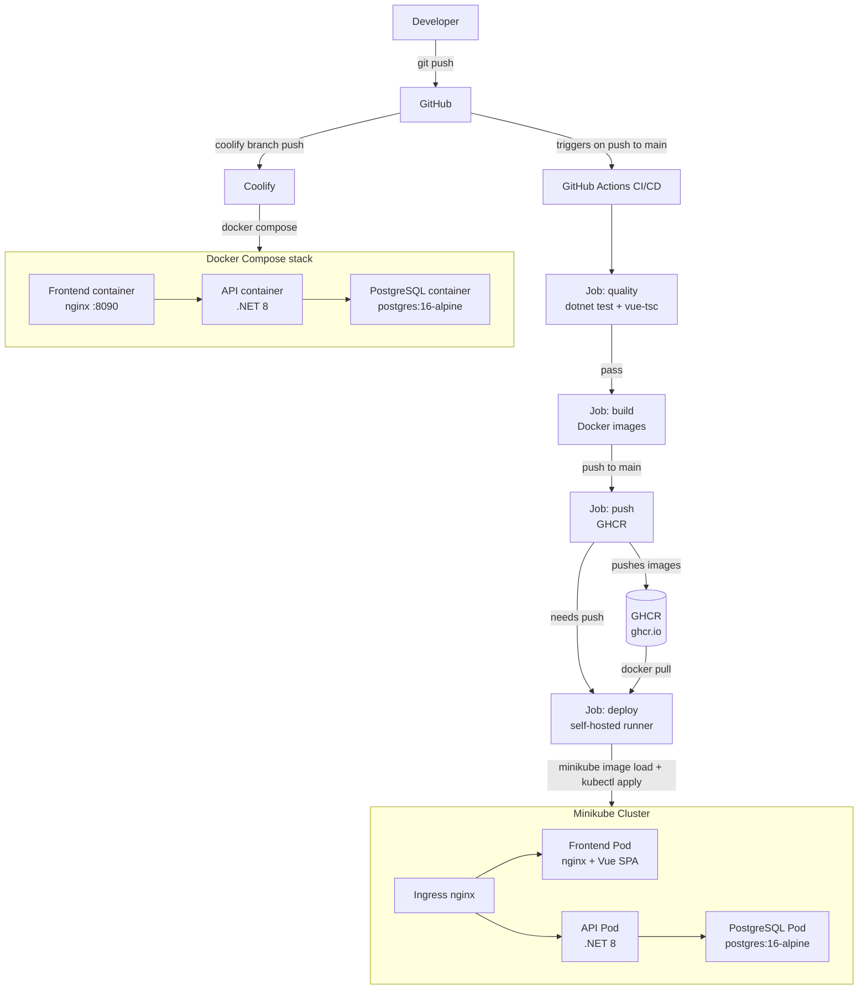

# BombasticIFC


A single-page application for managing and visualising IFC (Industry Foundation Classes) building models. Users authenticate, upload `.ifc` files, track conversion progress, and inspect 3D models interactively in the browser using the xeokit SDK.

---

## Tech stack

| Layer | Technology |
|---|---|
| Frontend | Vue 3 + TypeScript, Vite, Pinia, Vue Router, Tailwind CSS v4, vee-validate + Zod |
| 3D Viewer | xeokit-sdk v2.6, xeokit-convert v1.3.1 (IFC to XKT conversion) |
| Backend API | .NET 8 ASP.NET Core, Clean Architecture (5 layers) |
| ORM / CQRS | Entity Framework Core 8 (Npgsql), MediatR |
| Database | PostgreSQL 16 Alpine |
| Auth | JWT Bearer tokens, HS256, BCrypt (work factor 12) |
| Containerisation | Docker multi-stage builds — `Dockerfile` (API), `frontend/Dockerfile` (nginx) |
| Orchestration | Kubernetes manifests in `kubernetes/` — Minikube on Ubuntu VM |
| CI/CD | GitHub Actions — GHCR as container registry, self-hosted runner for deploy |

---

## Architecture



---

## Repository layout

```plaintext
BombasticIFCcluster.sln          .NET solution file
Dockerfile                        Multi-stage API image (sdk → publish → aspnet + node20 + xeokit-convert)
frontend/
  Dockerfile                      Multi-stage frontend image (node:20-alpine → nginx:alpine)
  nginx.conf                      nginx SPA config (try_files, /api proxy) — used in K8s
  src/
    api/                          Axios client + per-feature API modules
    components/                   AppHeader, ModelCard, XeokitPointViewer, PointPickerPanel, EntityAttributesPanel
    composables/                  useModelPolling.ts
    router/index.ts               Vue Router with auth guards
    stores/auth.ts                Pinia auth store (JWT token management)
    types/models.ts               TypeScript DTOs
    views/                        DashboardView, UploadView, ViewerView, LoginView, RegisterView
kubernetes/
  namespace.yaml                  Namespace: bombasticifccluster
  secrets.yaml                    K8s Secrets — NOT committed (gitignored)
  configmap.yaml                  Non-sensitive environment variables
  persistent-volumes.yaml         hostPath PVs for postgres (10 Gi) and storage (50 Gi)
  postgres-deployment.yaml        PostgreSQL 16 + ClusterIP service + NodePort 30432
  api-deployment.yaml             .NET API, replicas=2, liveness/readiness probes at /health
  frontend-deployment.yaml        Vue/nginx, replicas=2, rolling update
  ingress.yaml                    nginx ingress: / → frontend, /api → api, /health → api
src/
  BombasticIFC.API/               Controllers (Auth, Models, Conversions), Program.cs, appsettings
  BombasticIFC.Application/       CQRS commands/queries (MediatR), DTOs, interfaces
  BombasticIFC.Domain/            Entities (User, IfcModel, ConversionJob, ModelVersion), value objects, enums
  BombasticIFC.Infrastructure/    EF Core DbContext, repositories, TokenService, FileStorageService
  BombasticIFC.Shared/            AppConstants (MaxFileSize = 500 MB, allowed extensions)
test/
  BombasticIFC.Tests/             xUnit test project
docker/
  patch-btoa.js                   Patches @loaders.gl/polyfills btoa.node native addon post-install
Doku/                             Extended documentation (architecture, cluster, exam export)
```

---

## Getting started (local dev)

### Quickstart (Docker Compose / Coolify)

```bash
cp .env.example .env   # Edit DB_PASSWORD and JWT_SECRET
docker compose -f docker-compose.coolify.yml up -d
# App available at http://localhost:8090
```

### Prerequisites (Minikube path)

- [Minikube](https://minikube.sigs.k8s.io/docs/start/) with `kubectl`
- Node.js 20 (required for xeokit-convert native addon ABI compatibility)
- .NET 8 SDK

### Local development with Minikube

The same Kubernetes manifests used in production are used locally. There is no separate Docker Compose path.

**1. Start Minikube and enable the ingress addon (one-time setup):**

```bash
minikube start
minikube addons enable ingress
```


**2. Create the secrets manifest on your local machine (never commit this file):**

```bash
# kubernetes/secrets.yaml — create manually and keep gitignored
kubectl create secret generic bombasticifccluster-secrets \
  --namespace=bombasticifccluster \
  --from-literal=postgres-user=postgres \
  --from-literal=postgres-password=<your-db-password> \
  --from-literal=postgres-db=bombasticifcdb \
  --from-literal=connection-string="Host=postgres-service;Port=5432;Database=bombasticifcdb;Username=postgres;Password=<your-db-password>" \
  --from-literal=jwt-secret=<your-jwt-secret-min-32-chars> \
  --dry-run=client -o yaml > kubernetes/secrets.yaml
```


**3. Apply all manifests:**

```bash
kubectl apply -f kubernetes/namespace.yaml
kubectl apply -f kubernetes/secrets.yaml
kubectl apply -f kubernetes/configmap.yaml
kubectl apply -f kubernetes/persistent-volumes.yaml
kubectl apply -f kubernetes/postgres-deployment.yaml
kubectl apply -f kubernetes/api-deployment.yaml
kubectl apply -f kubernetes/frontend-deployment.yaml
kubectl apply -f kubernetes/ingress.yaml
```

**4. Access the application:**

```bash
# Get the Minikube IP
minikube ip

# The app is available at:
#   http://<minikube-ip>          (frontend via ingress)
#   http://<minikube-ip>/api      (API via ingress)
#   http://<minikube-ip>:30080    (API via NodePort — direct)
#   http://<minikube-ip>:30432    (PostgreSQL via NodePort — dev only)
```

**5. Tail API logs:**

```bash
kubectl logs -f deployment/api-deployment -n bombasticifccluster
```

**6. Tear down (keeps volumes / data):**

```bash
kubectl delete -f kubernetes/ --ignore-not-found
```

**7. Tear down and wipe data:**

```bash
kubectl delete namespace bombasticifccluster
```

### Running the backend only (no cluster)

```bash
cd src/BombasticIFC.API
dotnet run
# API available at http://localhost:5000
# Swagger UI at http://localhost:5000/swagger
# Requires a running PostgreSQL instance — set ConnectionStrings__DefaultConnection
```

### Running the frontend only

```bash
cd frontend
npm ci --legacy-peer-deps   # --legacy-peer-deps required by xeokit peer dependency constraints
npm run dev
# Dev server at http://localhost:5173
```

---

## Running tests

```bash
dotnet test
```

---

## Building Docker images

**API image** (from repository root):

```bash
docker build -t bombasticifccluster-api:latest .
```

**Frontend image**:

```bash
docker build -t bombasticifccluster-frontend:latest ./frontend
```

Both images use multi-stage builds. The API image includes a dedicated Node.js 20 stage to compile xeokit-convert native addons at the correct V8 ABI (ABI 115). The frontend image produces a static build served by nginx.

---

## Kubernetes deployment (Minikube)

### Prerequisites

- [Minikube](https://minikube.sigs.k8s.io/docs/start/)
- `kubectl` configured to target the Minikube cluster
- A self-hosted GitHub Actions runner installed on the VM (required for the automated deploy job)

### One-time VM setup

1. Enable the Minikube ingress addon — required for the nginx ingress controller to work:

```bash
minikube addons enable ingress
```

2. Install the self-hosted GitHub Actions runner: repo → **Settings → Actions → Runners → New self-hosted runner** → follow the Linux instructions.
3. No manual `docker login` needed — the deploy job authenticates automatically using `GITHUB_TOKEN` via `docker/login-action`.

### Manual deploy sequence

Apply manifests in dependency order. The `secrets.yaml` file must be created manually on the VM and is never committed — see [Environment variables / secrets](#environment-variables--secrets) below.

```bash
kubectl apply -f kubernetes/namespace.yaml
kubectl apply -f kubernetes/secrets.yaml          # created manually — never commit this file
kubectl apply -f kubernetes/configmap.yaml
kubectl apply -f kubernetes/persistent-volumes.yaml
kubectl apply -f kubernetes/postgres-deployment.yaml
kubectl apply -f kubernetes/api-deployment.yaml
kubectl apply -f kubernetes/frontend-deployment.yaml
kubectl apply -f kubernetes/ingress.yaml
```

### CI/CD automated deploy

The pipeline in `.github/workflows/ci.yml` runs four jobs on every push to `main`:

| Job | Runner | Trigger | What it does |
|---|---|---|---|
| `quality` | `ubuntu-latest` | push or PR to `main` | Restores, builds, and tests .NET; TypeScript type-check |
| `build` | `ubuntu-latest` | after `quality` passes | Builds both Docker images (no push) with GHA layer cache |
| `push` | `ubuntu-latest` | push to `main` only | Logs in to GHCR, rebuilds, pushes `latest` + `sha-<short>` tags |
| `deploy` | `self-hosted` | after `push` completes | Pulls images from GHCR, loads into Minikube, applies manifests, triggers rolling restart, waits for rollout |

The deploy job runs directly on the self-hosted runner where Minikube and `kubectl` already live — no inbound SSH connection is required.

### How migrations work (init-container pattern)

Migrations are applied by a **dedicated Kubernetes initContainer**, not at API startup. This prevents the class of 500 errors caused by swallowed migration exceptions at startup.

**How it works:** An `initContainer` named `migrator` runs in every API pod before the main `api` container starts. It uses the same image as the API container and invokes it with the `--migrate` flag. If the initContainer exits non-zero, Kubernetes halts the rollout and surfaces the error in `kubectl describe pod` — the API pod never starts, making the failure immediately visible.

```
Pod lifecycle:
  initContainer: migrator  →  exit 0  →  container: api starts
                            →  exit 1  →  pod stuck in Init:Error (rollout halted)
```

**Migrate-only CLI mode:**

```bash
dotnet BombasticIFC.API.dll --migrate
# exits 0 on success, 1 on failure
```

**Image parity:** The initContainer and the main API container always use the same image tag, so the migration assembly is always in sync with the running application code. Pushing a new image automatically applies any pending migrations on the next rollout.

**Emergency manual migration** (e.g., applying migrations to a running cluster without a full redeploy):

```bash
# Port-forward PostgreSQL and run EF CLI directly
kubectl port-forward svc/postgres-service 5432:5432 -n bombasticifccluster
dotnet ef database update --project src/BombasticIFC.Infrastructure --startup-project src/BombasticIFC.API
```

---

## Environment variables / secrets

The API reads configuration from environment variables at runtime. In Docker Compose these come from `.env`; in Kubernetes they come from `kubernetes/secrets.yaml` (for sensitive values) and `kubernetes/configmap.yaml` (for non-sensitive values).

| Variable | Required | Description |
|---|---|---|
| `ConnectionStrings__DefaultConnection` | Yes | PostgreSQL connection string (Host, Port, Database, Username, Password) |
| `JwtSettings__Secret` | Yes | HS256 signing key for JWT tokens — use a long random value |
| `ASPNETCORE_ENVIRONMENT` | Yes | `Development` (Docker Compose) or `Production` (Kubernetes) |
| `StoragePath` | Yes | Filesystem path for uploaded and converted files (e.g. `/data/storage`) |

> **`kubernetes/secrets.yaml` is gitignored and must never be committed.** Create it manually on the VM using `kubectl create secret generic ... --dry-run=client -o yaml > kubernetes/secrets.yaml` (see the Minikube quickstart above for the exact command). The file must contain base64-encoded values for `connection-string` and `jwt-secret`.

---

## API reference

Base path: `/api`

| Method | Path | Auth | Description |
|---|---|---|---|
| POST | `/api/auth/register` | None | Register a new user |
| POST | `/api/auth/login` | None | Login — returns a JWT |
| GET | `/api/auth/me` | JWT | Current user profile |
| GET | `/api/models` | JWT | List models (filtered to the authenticated user) |
| POST | `/api/models/upload` | JWT | Upload a `.ifc` file (max 500 MB) |
| GET | `/api/models/{id}` | JWT | Model details and associated conversion jobs |
| GET | `/api/models/{id}/output?format=XKT` | JWT | Download the converted output file |
| POST | `/api/conversions` | JWT | Create a conversion job |
| GET | `/api/conversions/{id}` | JWT | Get conversion job status and progress |
| GET | `/health` | None | Health check — used by K8s liveness and readiness probes |
| GET | `/swagger` | None | Swagger UI |

Tokens are JWT Bearer (HS256). Auth endpoints are rate-limited to 10 requests per minute. Access tokens expire after 60 minutes (development) or 120 minutes (production). Available roles: `User`, `Administrator`, `Viewer`.

---

## Architecture notes

- **Clean Architecture** — strict inward dependency rule: Domain has zero external dependencies. Layer order: Domain → Application → Infrastructure → API.
- **CQRS via MediatR** — commands (writes) and queries (reads) live in the Application layer; controllers dispatch via `IMediator` and do not contain business logic.
- **Repository pattern** — interfaces declared in Domain, implementations in Infrastructure. Soft delete is applied globally via EF Core query filters.
- **Result pattern** — all command/query handlers return `Result<T>`; controllers inspect success or failure before mapping to HTTP responses.
- **Error conventions** — 400 for validation failures, 401 for missing/invalid authentication, 403 for authorisation failures, 404 for missing resources, 409 for conflicts.
- **Health endpoint** — `GET /health` returns `{ "status": "healthy", "timestamp": "..." }` and is used by all three Kubernetes probes (startup, liveness, readiness) on port 8080.
- **Port conventions** — API container port 8080 (Kubernetes) / mapped to 5000 on the host in Docker Compose; frontend container port 80.

---

## Entscheidungen

### Plattform: Coolify + Kubernetes

Das Projekt setzt zwei Deployment-Ziele ein: Kubernetes (Minikube auf einer lokalen Ubuntu-VM) und Coolify (selbst gehostete PaaS-Plattform, Branch `coolify`). Die Prüfungsanforderung (HFI_DEP) verlangt explizit mehrere Umgebungen, wodurch eine einzelne Zielplattform nicht ausreichen würde. Coolify wurde als zweite Zielplattform gewählt, weil es Docker-Compose-Stacks mit wenigen Klicks deployt und keine Kubernetes-Kenntnisse voraussetzt — ideal für eine erste, schnell aufzusetzende Umgebung. Kubernetes wurde beibehalten, weil es echte Produktionsmerkmale bietet: Namespaces, Rolling Updates mit `maxUnavailable: 0`, Health-Probes, Ressourcenlimits und deklarative Manifests, die direkt auf K3s oder einen Managed Cluster portierbar sind. Alternativen wie ein einzelner Docker-Compose-Stack ohne Orchestrierung oder ein Cloud-PaaS (Render, Railway) wurden verworfen, weil sie entweder keine Kubernetes-Erfahrung vermitteln oder laufende Kosten erzeugen.

### Datenbankwahl: PostgreSQL

PostgreSQL 16 Alpine wurde als einzige Datenbankwahl eingesetzt — sowohl in Docker Compose als auch in Kubernetes. SQLite wäre für die Entwicklungsumgebung einfacher gewesen, scheidet jedoch aus zwei Gründen aus: Es ist nicht multi-replica-fähig (die API läuft mit `replicas: 2`) und unterstützt keine JSON-Spalten als EF-Core-Owned-Entity, die das `Metadata`-Feld von `IfcModel` nutzt. Der Npgsql-EF-Core-Provider ermöglicht direkt JSON-Persistenz ohne ORM-Umgehung. Durch die Verwendung von PostgreSQL in allen Umgebungen entfällt ausserdem die Dev/Prod-Parität als Fehlerquelle: Was lokal funktioniert, verhält sich auf dem Cluster identisch.

### CI/CD: GitHub Actions mit Self-Hosted Runner

Die Pipeline besteht aus vier Jobs: `quality`, `build`, `push` (alle auf `ubuntu-latest`) und `deploy` (auf `self-hosted`). GitHub Actions wurde gegenüber GitLab CI oder Jenkins gewählt, weil es direkt im Repository integriert ist und kein separater Server benötigt wird. GHCR (GitHub Container Registry) ersetzt Docker Hub, weil der `GITHUB_TOKEN` für Login und Push ausreicht — kein separater Account, keine Rate-Limit-Probleme. Der self-hosted Runner ist notwendig, weil die VM keine öffentliche IP besitzt: Cloud-Runner könnten sie nicht per SSH erreichen. Der self-hosted Runner initiiert eine ausgehende Verbindung zu GitHub und empfängt den Deploy-Job lokal — kein Port-Forwarding, kein VPN. Das Fail-fast-Prinzip (scheitert `quality`, laufen `build` und `deploy` nicht) spart Build-Minuten und gibt sofort klares Feedback.

### Container-Architektur: Multi-Stage Builds

Beide Dockerfiles verwenden Multi-Stage-Builds, um Build-Laufzeit und Produktions-Image strikt zu trennen. Das API-Image durchläuft die Stufen `sdk` (dotnet publish), `node` (xeokit-convert Native-Addon-Kompilierung) und `aspnet` (Laufzeit). Die Node-Stufe muss exakt Node.js 20 (V8 ABI 115) verwenden, weil xeokit-convert ein natives Addon (`btoa.node`) enthält, das gegen die V8-Version des Laufzeit-Node kompiliert wird — ein abweichendes Node führt zu einem `Invalid ELF header`-Fehler beim Import. Ohne Multi-Stage würde das finale Image das gesamte .NET SDK (~800 MB) und die Node-Toolchain einschliessen; mit Multi-Stage beträgt die API-Imagegrösse rund 280 MB. Das Frontend-Image nutzt `node:20-alpine` nur für den Vite-Build und liefert das Ergebnis an `nginx:alpine` aus, sodass kein Node.js im Laufzeit-Container verbleibt.

---

## Learnings

- **Node.js ABI-Version pinnen ist nicht optional.** Das native Addon `btoa.node` von xeokit-convert ist gegen ABI 115 (Node 20) kompiliert. Jede Abweichung — Node 18 (ABI 108) oder Node 22 (ABI 127) — führt beim Import zu einem nicht-sprechenden `Invalid ELF header`-Fehler. Beim nächsten Projekt würde man entweder eine reine npm-Bibliothek ohne native Addons wählen oder das Addon von Anfang an in einem eigenen, fest gepinnten Container isolieren.

- **InitContainer-Migrationsmuster von Anfang an einsetzen.** Migrationen beim API-Start via `db.Database.Migrate()` auszuführen hat im Projekt zu einer ganzen Klasse von HTTP-500-Fehlern geführt, als ein neuerer Code mit einer älteren Image-Version zusammentraf. Das InitContainer-Muster — ein separater `migrator`-Container, der vor dem API-Pod exitiert — macht Migrationsfehler sofort sichtbar und verhindert, dass ein inkonsistentes Schema den laufenden Pod beschädigt. Beim nächsten Projekt wird dieses Muster als erstes Deployment-Detail eingerichtet.

- **Self-Hosted-Runner-Komplexität nicht unterschätzen.** Die Einrichtung des self-hosted Runners (Registrierung, Systemd-Service, Minikube-Umgebungsvariablen, GHCR-Login im Job) hat mehr Zeit gekostet als erwartet. Im Nachhinein hätte man früher evaluiert, ob Coolify als einzige Deployment-Zielplattform für den Prüfungsumfang ausreicht — Coolify deployt via Webhook ohne dedizierten Runner.

- **Non-Root-Container als Standard setzen.** Die Kubernetes-Manifests laufen aktuell ohne `runAsNonRoot: true` im Security Context. Das wurde während der Entwicklung aus Zeitgründen zurückgestellt. Beim nächsten Projekt wird `runAsNonRoot` von der ersten Manifest-Version an konfiguriert, weil eine nachträgliche Anpassung Dateipfad-Berechtigungen in Volumes und Healthcheck-Skripte beeinflusst.

- **`.env.example` ist ein Team-Vertrag, kein Nice-to-Have.** Fehlende Umgebungsvariablen-Dokumentation hat beim Onboarding zu Verwirrung geführt: Welche Variablen sind erforderlich? Welche haben sinnvolle Defaults? Eine vollständige `.env.example` mit Kommentaren zu jedem Wert hätte diese Reibung von Anfang an eliminiert.

- **Zwei Deployment-Ziele verdoppeln die Komplexität — aber der Lernwert ist hoch.** Die Coolify-Integration erforderte Anpassungen an `nginx.conf` (von hartcodierten K8s-DNS-Namen zu `${API_UPSTREAM}` via `envsubst`), an `Program.cs` (JWT-Secret-Fallback) und an der Compose-Datei (Migrate-Service als InitContainer-Ersatz). Diese Komplexität war lehrreich: Man versteht Abstraktionsebenen besser, wenn man dieselbe Anwendung auf zwei fundamental verschiedenen Plattformen zum Laufen bringt.

- **Healthcheck-Abhängigkeiten in Docker Compose sind kritisch.** `depends_on: condition: service_started` reicht nicht aus — der API-Container startete und crashte, weil PostgreSQL noch keine Verbindungen akzeptierte. `condition: service_healthy` mit `pg_isready`-Healthcheck löst dieses Startverhalten zuverlässig. Dieses Detail ist bei Kubernetes durch Readiness-Proben automatisch gelöst, in Docker Compose muss es explizit konfiguriert werden.
